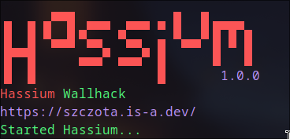
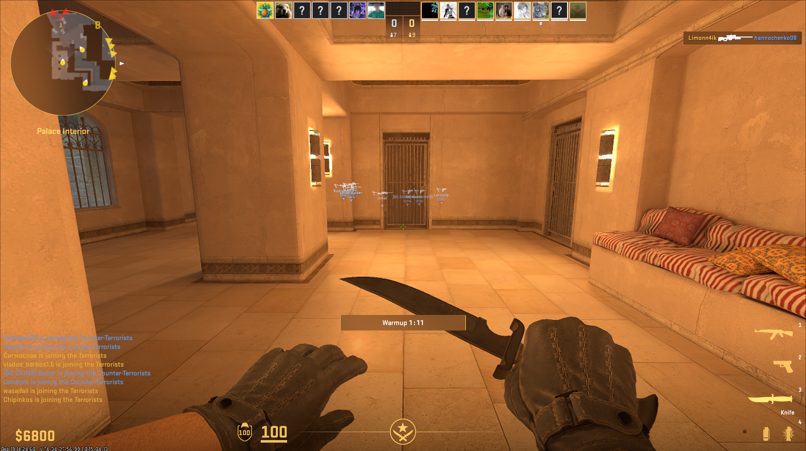

## Hassium Wallhack 

**A simple wallhack for Linux systems.**

**Note:** This wallhack is specifically designed for Linux systems. It will **not** function on any other operating system.
**How it works:**

This wallhack modifies game behavior by treating every player as a friendly entity. 
This results in the game displaying:

* **Overhead indicators** for all players, including enemies.
* **Used weapon information** for all players, including enemies.

**Created with ❤️ in Poland**

**Disclaimer:** This wallhack may violate the game's terms of service. Use at your own risk.

**Download**

1. Compile from source

or

2. Use prebuild binaries in releases